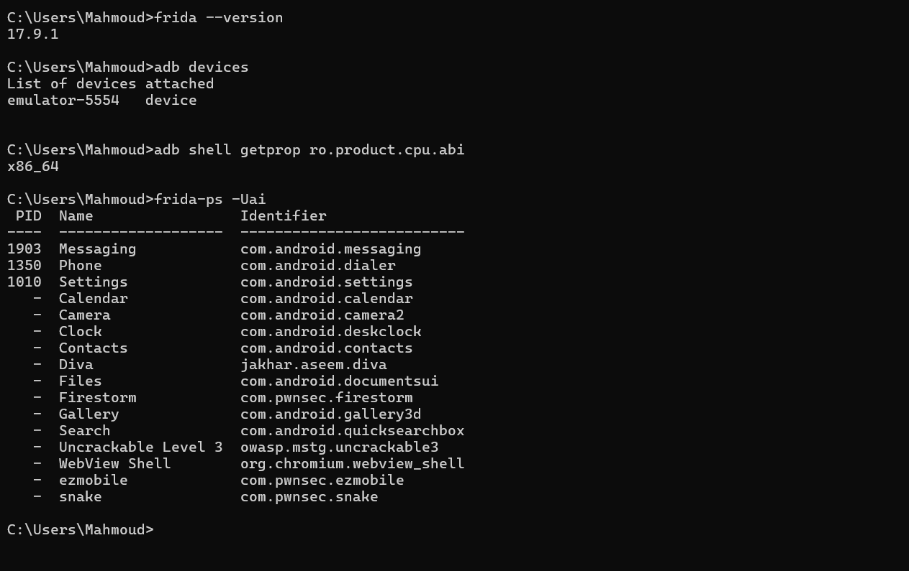
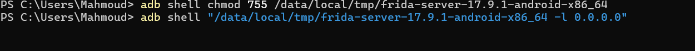
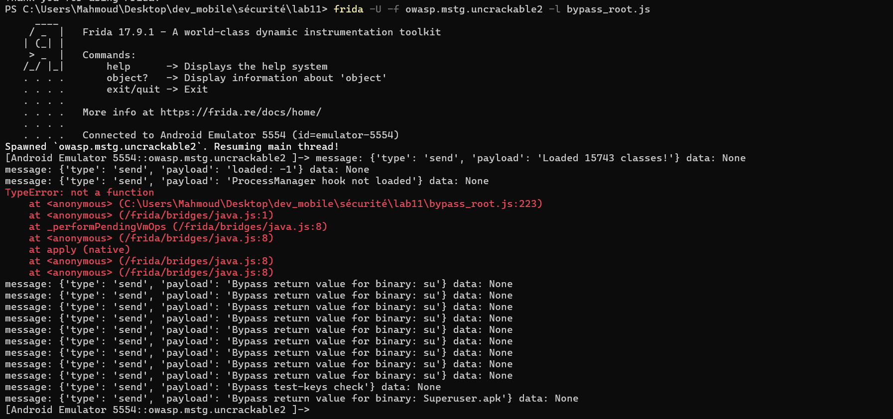
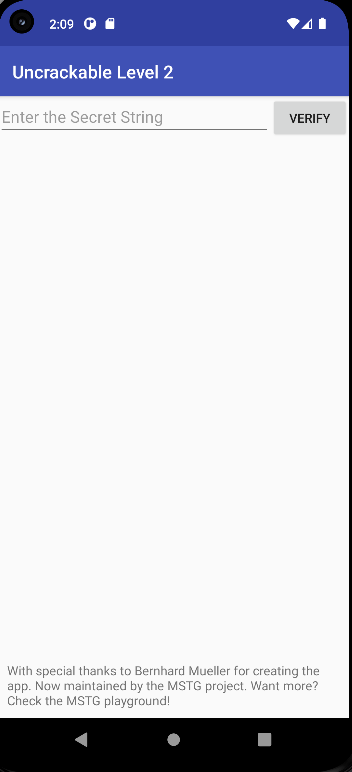
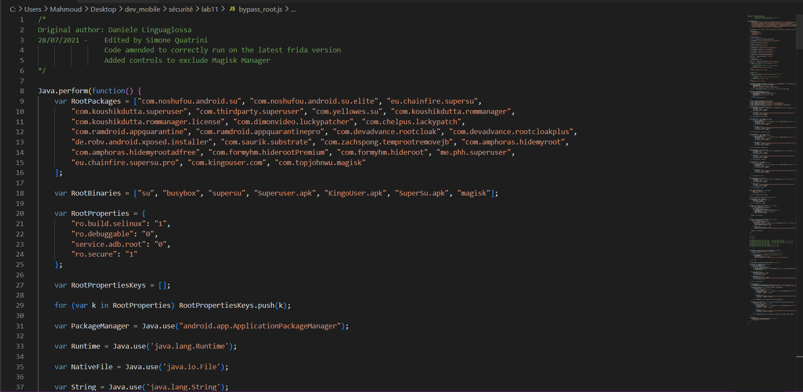

# Lab 11 : Bypassing Android Root Detections with Frida (Advanced Hooks)

## Introduction
Ce laboratoire présente les techniques avancées de contournement de la détection de root sur Android à l'aide de Frida. Nous étudions l'interception de contrôles Java (API standard Android, bibliothèques comme RootBeer) ainsi que l'interception et le blocage de vérifications de bas niveau (C/C++ natif via le NDK) en hookant des appels système du système de fichiers (`open`, `openat`, `access`, `stat`, `lstat`).

---

## Rappel express — Préparer l'environnement
Pour rappel, `frida-server` doit être en cours d'exécution sur l'appareil Android ciblé (émulateur ou physique).

**1. Identification de l'architecture CPU**
```bash
adb shell getprop ro.product.cpu.abi
```
**2. Téléchargement et déploiement de frida-server**
Télécharger le serveur adapté depuis [les releases Frida](https://github.com/frida/frida/releases) et le pousser sur l'appareil :
```bash
adb push frida-server /data/local/tmp/
adb shell chmod 755 /data/local/tmp/frida-server
adb shell "/data/local/tmp/frida-server -l 0.0.0.0"
```
**3. Configuration de la redirection réseau**
```bash
adb forward tcp:27042 tcp:27042
adb forward tcp:27043 tcp:27043
```
**4. Vérification initiale**
```bash
frida --version
python -c "import frida; print(frida.__version__)"
adb devices
```
> **Preuve de vérification de version Frida et connectivité ADB**
> 

---

## Étape 1 — Démarrage et repérage du package
Nous connectons l'appareil et listons les applications installées pour identifier précisément le package cible (par exemple `com.scottyab.rootbeer.sample` ou un root checker personnalisé) :
```bash
frida-ps -Uai
```
> **Déploiement du serveur Frida et recherche du package**
> 

---

## Étape 2 — Script Frida de Bypass Java (`bypass_root.js`)
Les vérifications Java courantes consistent à :
1.  Lire `android.os.Build.TAGS` (à la recherche de signatures de développement `"test-keys"`).
2.  Vérifier l'existence de binaires et APKs de super-utilisateur (`su`, `busybox`, `Superuser.apk`) via `java.io.File.exists()`.
3.  Tenter de lancer des commandes système (`Runtime.exec()`).
4.  Utiliser la bibliothèque tierce de référence **RootBeer** (`isRooted()`, `isRootedWithBusyBoxCheck()`).

Le script `bypass_root.js` intercepte et neutralise l'ensemble de ces points d'entrée :
```javascript
// Extrait de bypass_root.js
Java.perform(function () {
  // Hook Build.TAGS
  const Build = Java.use('android.os.Build');
  Object.defineProperty(Build, 'TAGS', { get: function() { return 'release-keys'; } });

  // Hook RootBeer
  const RootBeer = Java.use('com.scottyab.rootbeer.RootBeer');
  RootBeer.isRooted.implementation = function () { return false; };

  // Hook File.exists
  const File = Java.use('java.io.File');
  File.exists.implementation = function () {
    const path = this.getAbsolutePath();
    if (suspiciousPaths.indexOf(path) !== -1) {
      console.log('[+] File.exists bypass for', path);
      return false;
    }
    return this.exists.call(this);
  };
});
```

Pour lancer l'application en lui injectant le script dès le démarrage :
```bash
frida -U -f com.scottyab.rootbeer.sample -l bypass_root.js --no-pause
```
> **Injection du script de bypass Java et logs d'interception**
> 

---

## Étape 3 — Injection des Hooks Natifs (`bypass_native.js`)
Lorsque l'application s'appuie sur le NDK (C/C++) pour outrepasser les hooks Java standard, elle utilise des appels système directs à la recherche de fichiers sensibles dans l'arborescence. Nous interceptons ces fonctions de bas niveau de la `libc.so` :
*   `open` et `openat`
*   `access`
*   `stat` et `lstat`

Le script `bypass_native.js` identifie les requêtes de fichiers critiques (`/system/bin/su`, `/proc/mounts`, etc.) et simule une erreur d'inexistence (renvoyant `-1`) :
```javascript
// Extrait de bypass_native.js
function hookFunc(name, argIndexForPath) {
  const addr = Module.getExportByName(null, name);
  Interceptor.attach(addr, {
    onEnter(args) {
      const pathPtr = args[argIndexForPath];
      if (pathPtr && isSuspiciousPath(pathPtr)) {
        this.block = true;
        this.path = pathPtr.readCString();
      }
    },
    onLeave(retval) {
      if (this.block) {
        console.log('[+] Blocked', name, 'on', this.path);
        retval.replace(ptr(-1));
      }
    }
  });
}
```

Pour lancer l'analyse en combinant les deux niveaux de protection (Java & Natif) :
```bash
frida -U -f com.scottyab.rootbeer.sample -l bypass_root.js -l bypass_native.js --no-pause
```
> **Injection combinée des scripts Java et Natifs**
> 

---

## Étape 4 — Masquage des traces Frida (`anti_frida.js`)
Pour contrer les applications intégrant des contre-mesures détectant Frida elle-même (analyse de variables d'environnement ou scan de ports), nous injectons `anti_frida.js` :
1.  **System.getenv** : Masque les variables d'environnement contenant `"frida"`.
2.  **Socket.connect** : Intercepte les connexions locales de détection de ports (notamment `27042` et `27043`) et lève une exception de refus de connexion.

```bash
frida -U -f com.scottyab.rootbeer.sample -l bypass_root.js -l bypass_native.js -l anti_frida.js --no-pause
```

---

## Étape 5 — Traçage dynamique avec `frida-trace`
Afin de découvrir à la volée quelles fonctions natives de lecture sont sollicitées au moment de l'ouverture de l'application, nous démarrons `frida-trace` :
```bash
frida-trace -U -i open -i access -i stat -i openat -i fopen -i readlink com.scottyab.rootbeer.sample
```
Cette commande génère automatiquement des fichiers gestionnaires que nous pouvons modifier pour surveiller ou manipuler dynamiquement les valeurs passées en argument.

> **Validation finale : Détection contournée ("Not rooted") & Traces d'appels**
> 

---

## Conclusion et Livrables du Lab
Ce dépôt contient les ressources logicielles complètes pour reproduire le bypass :
*   `bypass_root.js` : Le script d'instrumentation Java complet et sophistiqué.
*   `bypass_native.js` : Le hook natif pour bloquer les appels bas niveau de recherche de fichiers.
*   `anti_frida.js` : Le script de camouflage contre les mécanismes de détection de Frida.
